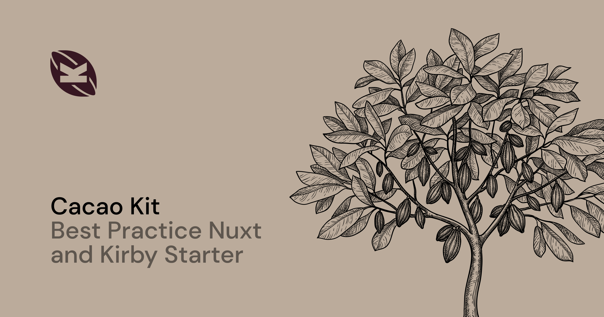
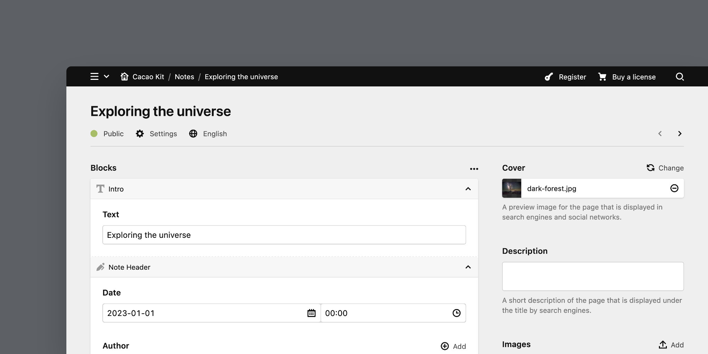

[](https://cacao-kit.byjohann.dev)

# Cacao Kit (Backend)

This headless starter kit is based on the [Kirby Headless Starter](https://github.com/johannschopplich/kirby-headless-starter) and provides a ready-to-use headless Kirby setup for the [Cacao Kit frontend](https://github.com/johannschopplich/cacao-kit-frontend). Demo content is included to showcase the starter's features.

With this Kirby project setup, every page-related component is a block. By default, the frontend fetches the same **page query** for every page and renders the blocks or layouts accordingly. This way, the backend defines the content structure while the routing doesn't have to be re-implemented in the frontend.

Of course, you can also use custom Kirby fields in your blueprint and create Nuxt pages in the frontend with custom queries. See the about page for an example.

If the block-first architecture doesn't fit your needs, you can still build upon this starter and use Kirby's built-in blocks. See the [cookbook](#cookbook) for more information.



## Prerequisites

- PHP 8.1+

> Kirby is not a free software. You can try it for free on your local machine but in order to run Kirby on a public server you must purchase a [valid license](https://getkirby.com/buy).

## Setup

### Composer

Kirby-related dependencies are managed via [Composer](https://getcomposer.org) and located in the `vendor` directory. To install them, run:

```bash
composer install
```

### Environment Variables

Duplicate the [`.env.development.example`](.env.development.example) as `.env`:

```bash
cp .env.development.example .env
```

It's recommended to secure your API with a token. To do so, set the environment variable `KIRBY_HEADLESS_API_TOKEN` to a token string of your choice.

Also, to enable the preview button in the frontend, set the environment variable `KIRBY_HEADLESS_FRONTEND_URL` to the URL of your frontend deployment:

## Usage

> [📖 Read the Cacao Kit frontend documentation](https://github.com/johannschopplich/cacao-kit-frontend)

> [📖 Read the Kirby Headless Starter documentation](https://github.com/johannschopplich/kirby-headless-starter), from which this starter is based on.

### Blocks

By default, every page-related component is a block. The [`blocks` field](./site/blueprints/fields/blocks.yml) blueprint defines the blocks that are available for each page. It contains page-building blocks like a notes grid, but also the `prose` block, which is used to render WYSIWYG content (it's another blocks' field under the hood).

If you don't want to nest blocks, you can add Kirby's built-in block `fieldsets` to the `blocks` field blueprint.

## Cookbook

### How to Add a New Block

If you prefer to use a block-first approach, you can add new blocks to your Kirby project by following these steps:

- Create a new blueprint in the [`site/blueprints/blocks`](./site/blueprints/blocks/) directory.
- Add the new block to the [`blocks` field](./site/blueprints/fields/blocks.yml) blueprint.
- Finally, follow the block guide [in the Cacao Kit frontend](https://github.com/johannschopplich/cacao-kit-frontends#how-to-add-a-new-block).

> [!NOTE]
> If the new block contains a `files` field, make sure to follow the [`toResolvedBlocks()` field method guide](https://github.com/johannschopplich/kirby-headless#toresolvedblocks) if you want to resolve image UUIDs to file objects on the server.

### Deployment

> [!NOTE]
> See [ploi-deploy.sh](./scripts/ploi-deploy.sh) for exemplary deployment instructions.

> [!NOTE]
> Some hosting environments require uncommenting `RewriteBase /` in [`.htaccess`](./public/.htaccess) to make site links work.

## License

[MIT](./LICENSE) License © 2023-present [Johann Schopplich](https://github.com/johannschopplich)
