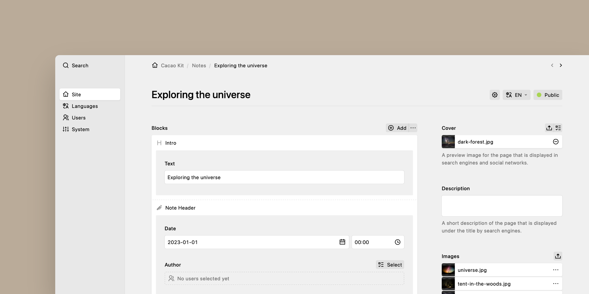

<div align="center">

[](https://cacao-kit.byjohann.dev)

# Cacao Kit (Backend)

A headless Kirby CMS starter where **everything is a block**.

[Setup](#setup) •
[Usage](#usage) •
[Cookbook](#cookbook)

</div>

## When to Use

| If you want to…                                  | This starter provides…                          |
| ------------------------------------------------- | ------------------------------------------------ |
| Build a headless Kirby + Nuxt site                | Pre-configured [Kirby Headless](https://kirby.tools/docs/headless) setup |
| Use Kirby's page structure as the source of truth | Block-first architecture with layouts            |
| Avoid duplicating routes in your frontend         | Single page query that works for all pages       |
| Still use custom blueprints when needed           | Flexibility to create custom Nuxt pages with KQL |

## Architecture

This starter is based on the [Kirby Headless Starter](https://github.com/johannschopplich/kirby-headless-starter) and pairs with the [Cacao Kit frontend](https://github.com/johannschopplich/cacao-kit-frontend).

**Block-first approach:** Every page-related component is a block. The frontend fetches the same page query for every page and renders blocks or layouts accordingly. The backend defines the content structure, so routing doesn't need to be re-implemented in the frontend.

You can also use custom Kirby fields in your blueprints and create dedicated Nuxt pages with custom KQL queries. See the about page for an example.



## Prerequisites

- PHP 8.2+

Kirby is not free software. However, you can try Kirby and the Starterkit on your local machine or on a test server as long as you need to make sure it is the right tool for your next project. … and when you’re convinced, [buy your license](https://getkirby.com/buy).

## Setup

### Composer

Kirby-related dependencies are managed via [Composer](https://getcomposer.org) and located in the `vendor` directory. To install them, run:

```bash
composer install
```

### Environment Variables

Duplicate the [`.env.development.example`](.env.development.example) as `.env`:

```bash
cp .env.development.example .env
```

It's recommended to secure your API with a token. To do so, set the environment variable `KIRBY_HEADLESS_API_TOKEN` to a token string of your choice.

Also, to enable the preview button in the frontend, set the environment variable `KIRBY_HEADLESS_FRONTEND_URL` to the URL of your frontend deployment:

## Usage

> [!TIP]
> [📖 Read the Cacao Kit frontend documentation](https://github.com/johannschopplich/cacao-kit-frontend) or [📖 read the Kirby Headless Starter documentation](https://github.com/johannschopplich/kirby-headless-starter), on which this starter is based.

### Blocks

By default, every page-related component is a block. The [`blocks` field](./site/blueprints/fields/blocks.yml) blueprint defines the blocks that are available for each page. It contains page-building blocks like a notes grid, and other custom blocks.

If you don't want to nest blocks, you can add Kirby's built-in block `fieldsets` to the `blocks` field blueprint.

## Cookbook

### Adding a New Block

1. Create a new blueprint in [`site/blueprints/blocks`](./site/blueprints/blocks/)
2. Add the block to the [`blocks` field](./site/blueprints/fields/blocks.yml) blueprint
3. Follow the [frontend block guide](https://github.com/johannschopplich/cacao-kit-frontend#adding-new-blocks) to create the matching component

> [!NOTE]
> If the block contains a `files` field and you want to resolve image UUIDs to file objects, see the [`toResolvedBlocks()` field method guide](https://kirby.tools/docs/headless/usage/field-methods#toresolvedblocks).

### Deployment

> [!NOTE]
> See [ploi-deploy.sh](./scripts/ploi-deploy.sh) for exemplary deployment instructions.
>
> Some hosting environments require uncommenting `RewriteBase /` in [`.htaccess`](./public/.htaccess) to make site links work.

## License

[MIT](./LICENSE) License © 2023-PRESENT [Johann Schopplich](https://github.com/johannschopplich)
